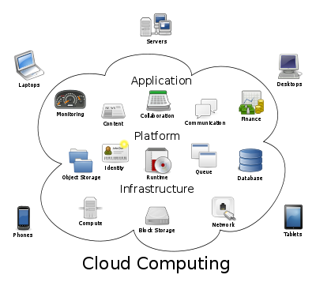
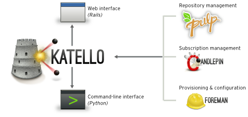

<!SLIDE title-slide>
# CloudForms QA 2012 #

## Martin Koci ##
## Senior QA Engineer Lead, Red Hat, Inc. ##
## 4.4.2012 ##

<!SLIDE bullets incremental>
# Content #

* What is cloud computing
* What are solutions
* What can be the problem here
* What is the solution
* The Implementation using CloudForms
  * Application Engine and QA
  * Cloud Engine and QA
  * System Engine and QA
  * Other QA teams - Matahari, DeltaCloud
* Conclusion
* Questions 

<!SLIDE bullets incremental transition=fade>
# What is cloud computing #

* Term w/ many definitions
* IaaS, PaaS, SaaS

<!SLIDE bullets incremental>
# What are solutions #

* Public Clouds
  * Resources are made available to the general public by a service provider
* Private Clouds
  * Infrastructure operated solely for a single organization
* Some examples
  - RHEV-M
  - EC2
  - VMWare vSphere
  - CondorCloud

<!SLIDE incremental>
# What can be the problem here #

* Too many different APIs and tools/interfaces
* Hard to handle/manage all of them

!SLIDE bullets incremental
# What is the solution #

* <b>AEOLUS!</b>
  * <b>www.aeolusproject.org</b>
  * www.deltacloud.org
  

  
  

<!SLIDE bullets incremental>
# The implementation using CloudForms #

* Describe Cloud Operations and Resources at a high level
* Using Application Egine
  * Oz
  * Image Factory
  * Image Warehouse
* Using Cloud Engine
  * Conductor
  * Aeolus Configure
  * Audrey - Set of tools to do run-time configuration of cloud instances
* Using System Engine
  * Katello - solution for controlling the lifecycle of your machines

!SLIDE 
# Application Engine QA #
 * pretty new team in Brno - myself so far :)
 * <b>0</b> people in Brno
 * Python/Ruby/RoR
 * http://www.aeolusproject.org/source.html
 
  
 
 
 

<b>
Check out: https://careers.redhat.com/ for Brno location 
(search words:  cloudforms/entitlement/identity management) 
or just send an email to me: mkoci@redhat.com
</b>

!SLIDE
# Cloud Engine QA #
 * <b>0</b> people in Brno
 * 4 people in US
 * 5 people in India
 * RoR/Python/Ruby
 * http://www.aeolusproject.org/source.html
  
 
 
 
 

<b>
Check out: https://careers.redhat.com/ for Brno location 
(search words:  cloudforms/entitlement/identity management) 
or just send an email to me: mkoci@redhat.com
</b>

!SLIDE 
# System Engine QA #
 * Systems management software
 * Control of your SW and systems through the web interface
 * 4 people in US
 * 2 people in Brno
 * 2 people in India
 * Java/Python
 (Internal demo: https://smqe-sat04.lab.eng.brq.redhat.com/katello)
     
   

   
   

!SLIDE
# Conclusion #

I'd be happy if you remmeber/note at least these:

* links
  * http://www.aeolusproject.org
  * http://www.deltacloud.org
  * http://www.katello.org
  * https://fedorahosted.org/katello/wiki
* mailing-lists
  * aeolus-devel@lists.fedorahoststed.org
  * iwhd-devel@lists.fedorahosted.org
  * katello@lists.fedorahosted.org

!SLIDE
# Do not forget - QA is fun ! #

moreover

* we have great working environment 
* you can touch new technologies
* meet with interesting people

 

!SLIDE
# Questions #
<h1>
 ? 
</h1>
\</presentation\>
 
Stay tuned for next presentation about
<h1>
RHEV-M/oVirt
</h1>

